# Rego

A secondhand marketplace where people can list items for sale, discover what's nearby, and chat with sellers in real time — built from scratch as a solo full-stack project.

**Live:** [rego.jakobg.tech](https://rego.jakobg.tech)


## The Journey

Rego started as a plain React + Express CRUD app — basic forms, no real design system, and everything held together with Create React App and raw CSS. Over time it evolved into something I'm actually proud of:

- **JavaScript to TypeScript** — migrated both client and server to strict TypeScript, catching entire categories of bugs at build time.
- **CRA to Vite** — faster dev server, faster builds, simpler config.
- **Scattered state to clean architecture** — replaced prop drilling and ad-hoc Redux with TanStack Query for server state and Redux only for auth. Introduced domain-based backend modules instead of flat route files.
- **No validation to Zod everywhere** — shared schemas validate on the frontend (instant feedback) and again on the backend (never trust the client).
- **Generic look to a real design system** — built a token-based design language (`design.css`) with CSS Modules, giving the app a consistent, polished feel.
- **Gmail SMTP to Resend** — moved transactional email to a proper provider with domain verification for reliable deliverability.

<details>
<summary>Before & After</summary>

| Page | Before | After |
|------|--------|-------|
| Homepage | 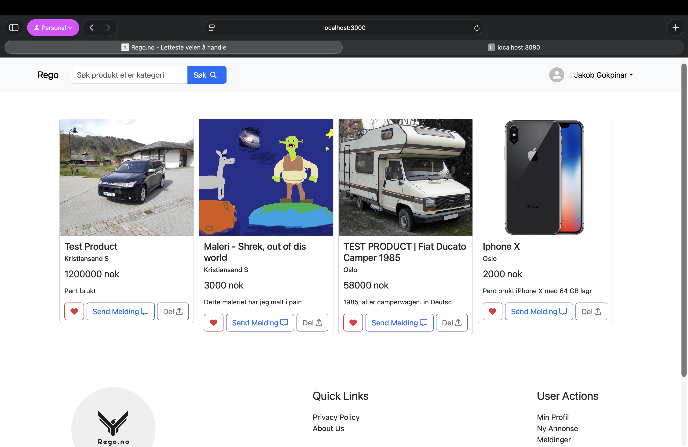 | 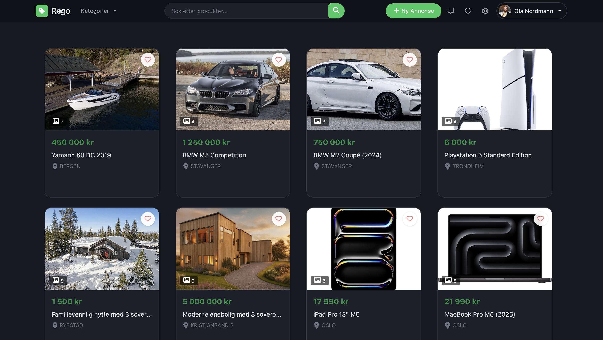 |
| Listing | 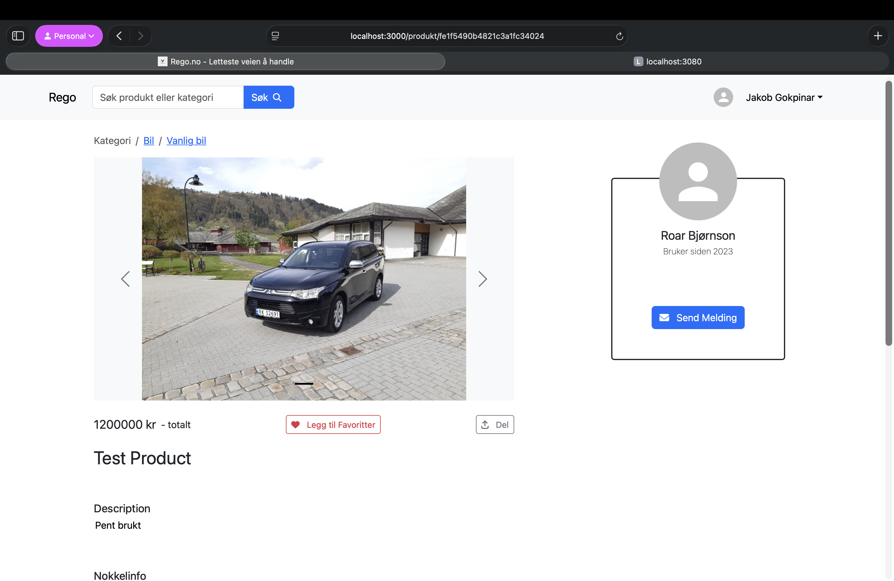 | 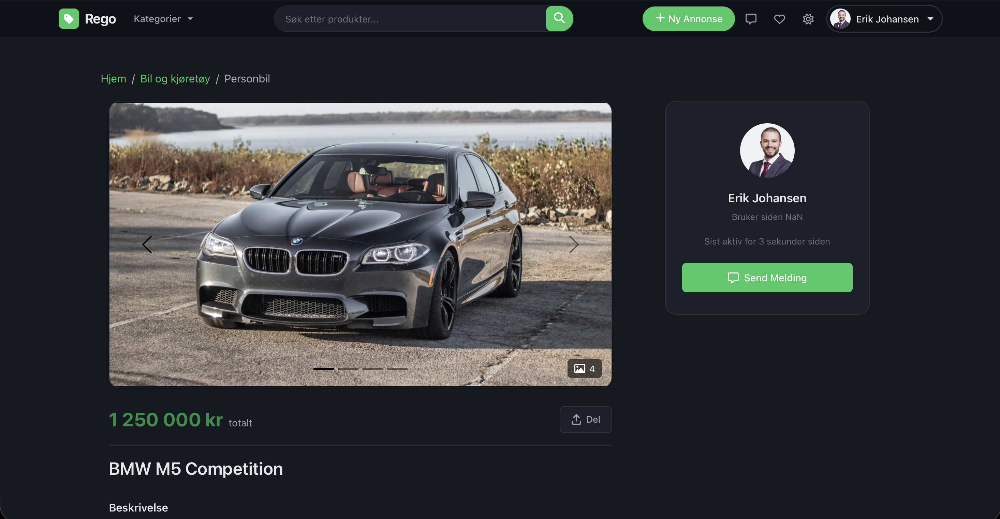 |
| Search | 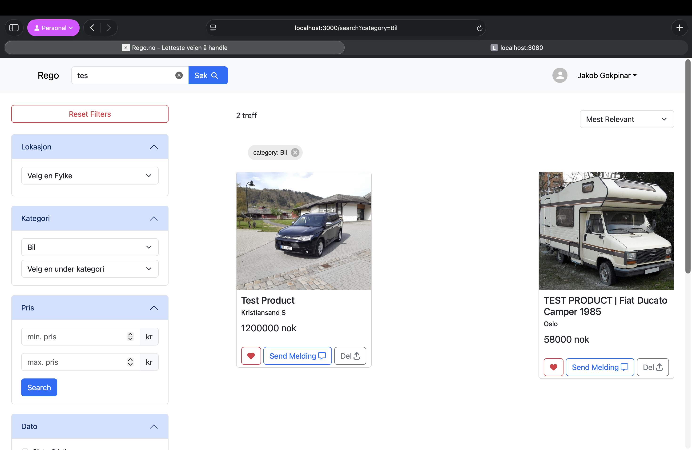 | 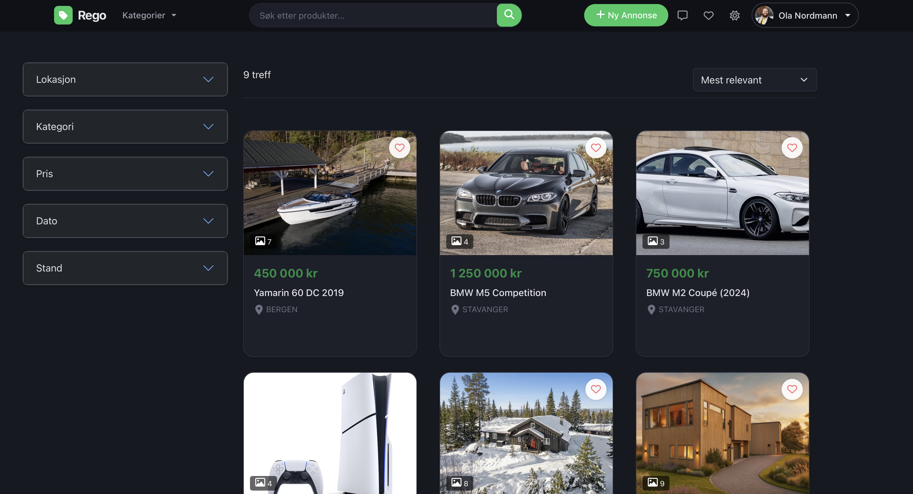 |
| Chat | 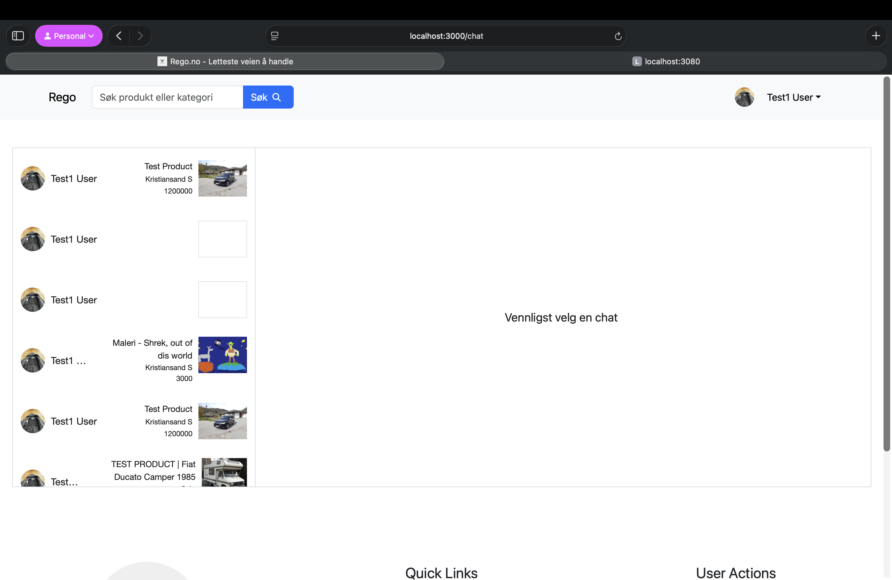 | 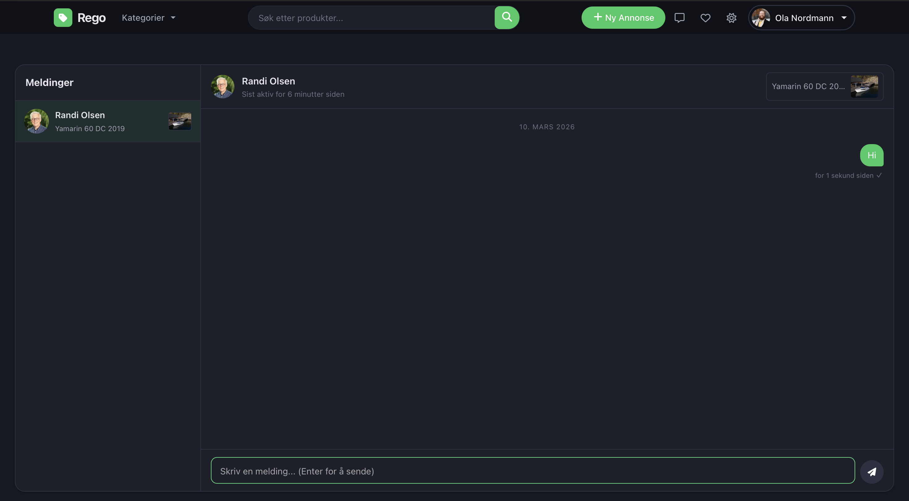 |
| Account | 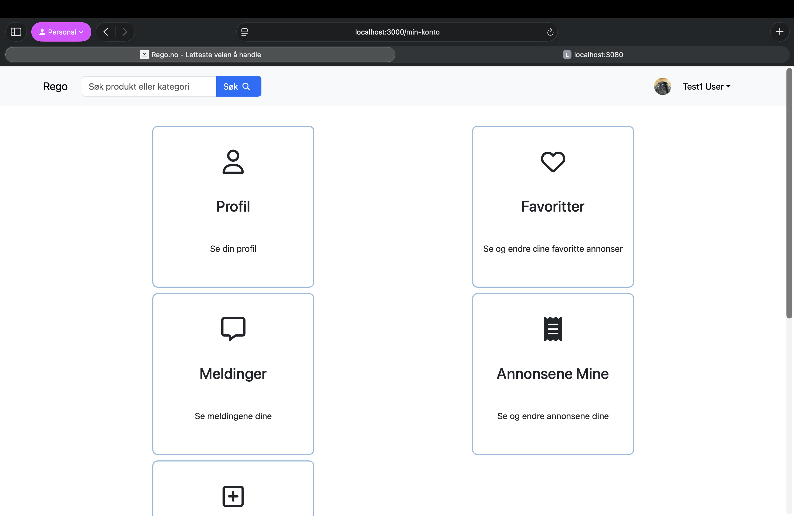 | 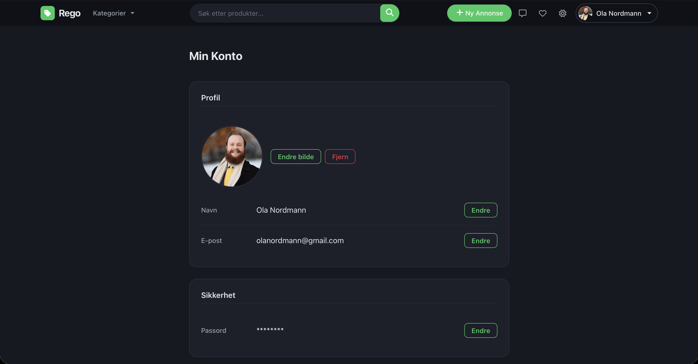 |
| Profile | 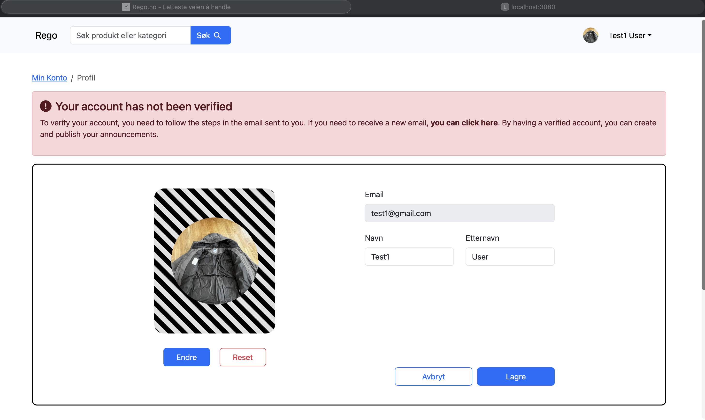 |  |

</details>

## Features

- **Listings** — Create, edit, and delete listings with up to 25 image uploads (compressed client-side, stored on S3). Drag-to-reorder images and per-image descriptions.
- **Search** — Partial-match search with live suggestions. Filter by category, subcategory, county (fylke), and municipality (kommune). Sort by price or date.
- **Real-time Chat** — Socket.io messaging between buyers and sellers with typing indicators, read receipts, and unread counts.
- **Favorites** — Save and manage favorite listings from anywhere in the app.
- **User Accounts** — Registration with email verification, profile pictures, password reset flow.
- **Norwegian Geo Data** — Postal code lookup via Geonorge API for automatic location detection.
- **Security** — Helmet headers, signed CSRF tokens, rate limiting on auth endpoints, Zod validation on all inputs, session-based auth with MongoDB store.

## Tech Stack

| Layer          | Technologies                                                                 |
|----------------|-----------------------------------------------------------------------------|
| **Frontend**   | React 18, TypeScript, Vite, Redux Toolkit, TanStack Query v5, React Router v6 |
| **UI**         | Bootstrap 5, CSS Modules, React Hot Toast                                   |
| **Backend**    | Node.js 22, Express, TypeScript (tsx), Passport.js, Socket.io              |
| **Database**   | MongoDB (Mongoose 8), connect-mongo sessions                               |
| **Storage**    | AWS S3 (multer-s3)                                                          |
| **Email**      | Resend (transactional email)                                                |
| **Validation** | Zod (shared frontend + backend schemas)                                     |
| **Testing**    | Vitest, Supertest                                                           |
| **Infra**      | Vercel (frontend), Railway (backend + MongoDB)                              |

## Project Structure

```
rego/
├── client/                     # React frontend (Vite + TypeScript)
│   └── src/
│       ├── components/         # Shared components (Navbar, Footer, ListingCard, ...)
│       ├── pages/              # Route-level pages
│       │   ├── home/           # Homepage with paginated listings
│       │   ├── listing/        # Single listing detail page
│       │   ├── new-listing/    # Create listing (form + preview)
│       │   ├── edit-listing/   # Edit existing listing
│       │   ├── search/         # Search results with filters
│       │   ├── chat/           # Real-time messaging
│       │   ├── favorites/      # Saved listings
│       │   ├── my-listings/    # Manage your listings
│       │   └── account/        # Profile settings
│       ├── store/              # Redux (auth only: userSlice, authThunks)
│       ├── services/           # API functions (axios)
│       ├── hooks/              # Custom hooks (useAuth, useChat, useDebounce, ...)
│       ├── schemas/            # Zod validation schemas
│       ├── types/              # Shared TypeScript interfaces
│       ├── lib/                # axios, socket, queryClient, queryKeys
│       └── design.css          # Design tokens and CSS variables
│
├── server/                     # Express backend (TypeScript)
│   ├── modules/
│   │   ├── auth/               # Login, signup, logout, email verification
│   │   ├── user/               # Profiles, favorites, user lookup
│   │   ├── listing/            # CRUD, search, browse
│   │   └── chat/               # Conversations, messages, unread
│   ├── models/                 # Mongoose models (User, Listing, Conversation, Message, Token)
│   ├── middleware/             # ensureAuth, validate, csrf, upload (multer-s3)
│   ├── config/                 # db, passport, sendEmail, logger, env
│   ├── services/               # Shared logic (S3 client)
│   └── server.ts               # Entry point (Express + Socket.io)
│
├── docs/                       # Screenshots and assets
└── README.md
```

## Local Development

### Prerequisites

- Node.js 22+
- MongoDB instance (local or Atlas)
- AWS S3 bucket (for image uploads)
- [Resend](https://resend.com) API key (for email verification)

### Setup

```bash
# Clone the repository
git clone https://github.com/JakobGokpinar/mern-marketplace.git
cd mern-marketplace

# Install dependencies
cd client && npm install && cd ..
cd server && npm install && cd ..
```

### Environment Variables

**client/.env**
```
VITE_API_URL=http://localhost:3080
VITE_SITE_URL=http://localhost:3000
```

**server/.env**
```
SESSION_SECRET=your-session-secret

# MongoDB
MONGODB_DEV=mongodb://localhost:27017/rego

# AWS S3
S3_BUCKET_NAME=your-bucket
S3_ACCESS_KEY=your-access-key
S3_SECRET_ACCESS_KEY=your-secret-key
S3_BUCKET_REGION=eu-north-1

# Email (Resend)
RESEND_API_KEY=re_xxxxxxxxxxxx
EMAIL_FROM=Rego <noreply@mail.yourdomain.com>
```

### Run

```bash
# Terminal 1 — backend
cd server && npm run dev

# Terminal 2 — frontend
cd client && npm run dev
```

Frontend runs on `localhost:3000`, API on `localhost:3080`.

### Tests

```bash
cd server && npm test
```

## API Overview

All endpoints are prefixed with `/api`.

| Method | Endpoint                       | Description                    | Auth |
|--------|--------------------------------|--------------------------------|------|
| POST   | `/auth/signup`                 | Register new user              | No   |
| POST   | `/auth/login`                  | Log in                         | No   |
| DELETE | `/auth/logout`                 | Log out                        | Yes  |
| POST   | `/auth/email/verify`           | Verify email token             | No   |
| POST   | `/auth/password/forgot`        | Request password reset         | No   |
| POST   | `/auth/password/reset`         | Reset password                 | No   |
| GET    | `/listings`                    | Browse listings (paginated)    | No   |
| GET    | `/listings/:id`                | Get single listing             | No   |
| POST   | `/listings/search`             | Search with filters            | No   |
| POST   | `/listings`                    | Create listing                 | Yes  |
| PUT    | `/listings/:id`                | Update listing                 | Yes  |
| DELETE | `/listings/:id`                | Delete listing + S3 cleanup    | Yes  |
| POST   | `/listings/images`             | Upload images to S3            | Yes  |
| GET    | `/user/me`                     | Get current user               | Yes  |
| PATCH  | `/user/me`                     | Update profile                 | Yes  |
| GET    | `/user/me/favorites`           | Get saved listings             | Yes  |
| POST   | `/user/me/favorites`           | Add favorite                   | Yes  |
| DELETE | `/user/me/favorites/:id`       | Remove favorite                | Yes  |
| POST   | `/chat/rooms`                  | Create/get conversation        | Yes  |
| GET    | `/chat/rooms`                  | Get conversations              | Yes  |
| GET    | `/chat/messages`               | Get messages for a room        | Yes  |
| POST   | `/chat/messages`               | Send message                   | Yes  |

## Author

Built by **Jakob Gokpinar** — [jakobg.tech](https://jakobg.tech)

Full-stack developer based in Norway. Rego is a solo project I've been building and iterating on to sharpen my skills across the entire stack — from database design and API architecture to responsive UI and real-time features.
